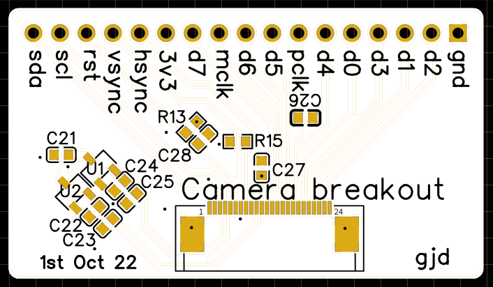

# Dufus-Cam

The original idea the Dufus project was to develop various boards and code to drive 1 bit e-paper screens on the esp32-C3 and esp32-S3 chips.

The name Dufus was inspired by the DFU USB code upload availability of the esp32-S3 chips.
Eventually this GIT will contain both “open source” hardware design and esp-idf code to run the camera.

The camera was my most recent design idea, inspired by the vast number of available GPIO pins on the ESP32-S3.
I envision that the basic product will live in a small box and work as a BLE camera showing small images on the 1 bit e-paper screen with the higher definition images available via Bluetooth.

Most controls will be driven by the touch screen with one pin broken out for the shutter release.

## raison d'etre

My own personal final goal in this project is to house the camera inside an 20 x 18 inch extra large format film view camera.

The camera would show what the film will eventually be exposed to and thus bring the digital world back into the analogue one. It will create a film camera with a historgram and other digital information normally available only in digital cameras.

These cameras have very long exposure times which can be time consuming or take years of experience to calculate. This could all be done in the code itself. 

I am currently working with the [2.7 GDEY027T91 epaper screens](https://www.good-display.com/product/432.html) from Dalian Good Display Co. 

The **Dufus-Cam** board is designed to fit neatly behind that screen this is possible if you use the S3-Wroom-IU and an external antenna.
It is not generally available with the touch screen however as I have purchased 10 of these items they are happy to add
the matching capacitive touch panel.

***This is a partially tested prototype board. The epaper, touch screen, RGB LED array and the shutter pin work fine. The Camera breakout works and has been partially tested. ***

### Camera breakout

I have also added a simple camera breakout board to allow breadboard testing of cameras and controllers.

### Where is everything?
Most things are in the folder named as such.
The full BOM including LCSC part numbers for both boards are in the boms folder.
Also the gerbers are ready to just upload directly to JLCPCB for fabrication.

### How to add it to your local Easyeda projects

It's pretty straight forward really. 

The hardest part is finding your easyeda offline projects file. On Linux that's in ~/.easyeda/projects. Once you find it simply copy either of the folders in the easyeda folder to that directory. Then open easyeda and find it in your unopened projects. Hopefully it should all just work from there.

## So what's it look like?
### Dufus-Cam in 3D

### Layout

### Camera breakout

