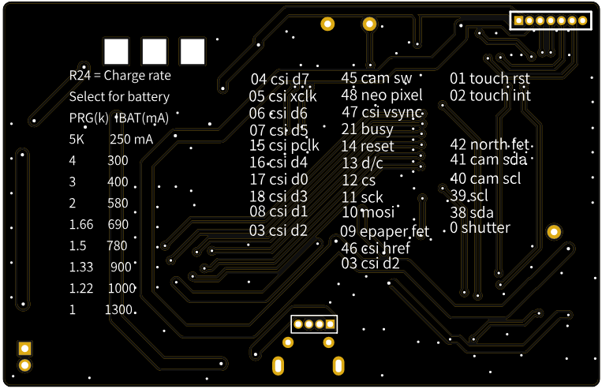

# Dufus-Cam

The original idea the Dufus project was to develop boards and code to drive 1 bit epaper screens.

The name Dufus was in reaction to the DFU USB code upload available on the esp32-S3 chips.
Eventually this GIT will contain both open source hardware design and the esp-idf code to run the camera.

I envision that the finaly product will live in a small box and work as a BLE camera showing small images on the screen with the higher deffinition images available ver bluetooth.

##raison d'etre

My real goal in this project is to house the camera inside an extra large format film camera. That would be something like 20 x 18 inch film negatives.
The camera would show what the film will eventually be exposed to and thus bring the digital world back into the analogue one. It will create a film camera with a historgram and other digital information normally available only in digital cameras.

I am currently working with the [2.7 GDEY027T91 epaper screens](https://www.good-display.com/product/432.html) from Dalian Good Display Co. 

The **Dufus-Cam** board is designed to fit neatly behind that screen.
It is not generally available with the touch screen however as I have purchased 10 of these items they are happy to add
the matching capacitive touch panel.

The schematic is still a mess but I will sort that out soon.

**gotchas**

So far I have found one possible problem.

Ths camera communicates with SCCB which is a non standard I2C. I have added other I2C devices namely the touch sensor. This could be a problem, butt until I have the device in my hand I will not be sure.

***This is an untested prototype board that I have only just ordered.***

## So what's it look like?
### Dufus-Cam in 3D

### Layout

