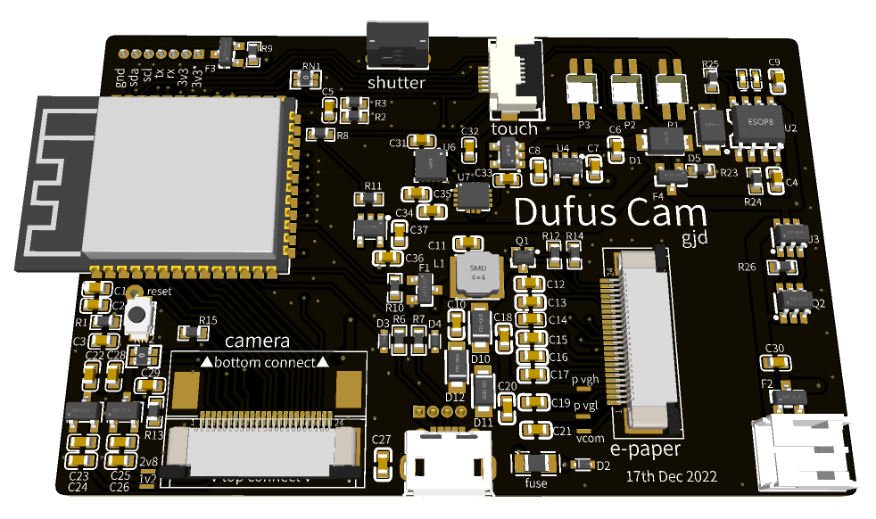
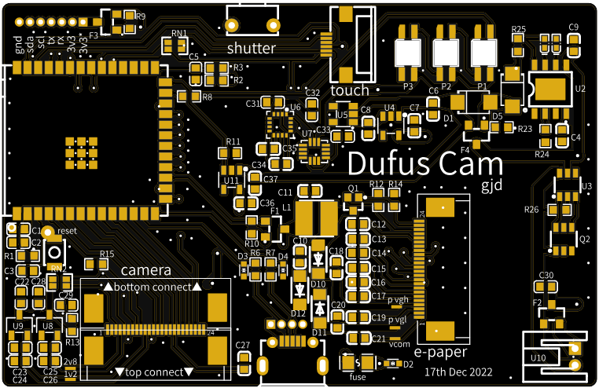

# Dufus-Cam

The original idea the Dufus project was to develop boards and code to drive 1 bit epaper screens.

I am currently working with the [2.7 GDEY027T91 epaper screens](https://www.good-display.com/product/432.html) from Dalian Good Display Co. 

The **Dufus-Cam** board is designed to fit neatly behind that screen.
It is not generally available with the touch screen however as I have purchased 10 of these items they are happy to add
the matching capacitive touch panel.

The schematic is still a mess but I will sort that out soon.

* This is an untested prototype board that I have only just ordered. *

So what's it look like?
-----------------------------------------------

